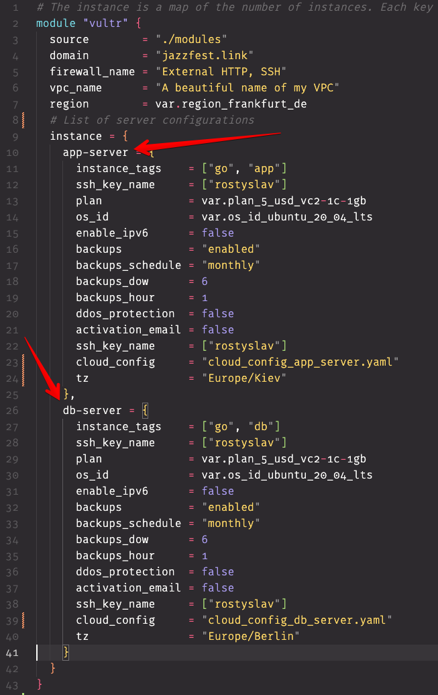
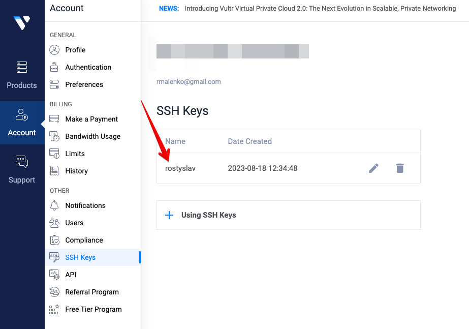
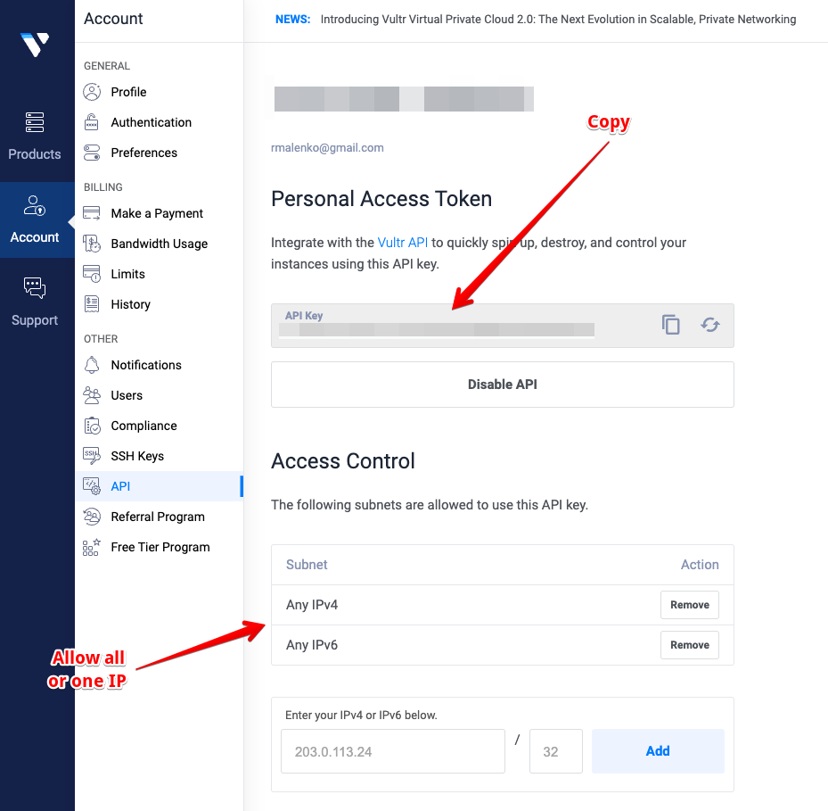

# Vultr Servers
It is provisioning on Vultr several servers in one zone, including Ansible tasks.

If you have already done that, you may skip these steps
- at first you need to add an SSH key, note its name,
- create and record the API key
- and insert the key into `terraform.tfvars` `VULTR_API_KEY = "IO....Q"`

## Variables
It the file `01-main.tf` add or, change the number of servers you need, or remove one server. Look for `# Instanse`.

### Domain and SSL certificates
These keys are used for server and host names and Ansible playbook names.

*For example:*
- `app-server` + `var.domain` = `app-server.jazzfest.link`

In this case, `app-server` is the first key `[0]`, and the public IP of this instance will be used as the primary server in this infrastructure. This server could be a load balancer or just for all wanted applications.

Important:

- IP of the first server used for `@` and `www` DNS records.
- SSL certificate (Letsencrypt) will be issued for wildcard domains: `jazzfest.link`, `*.jazzfest.link` using [Lego](https://github.com/go-acme/lego) - Let's Encrypt client and ACME library. Follow the link for more information. We assume we use Vultr DNS. And our NS servers were appropriately configured.

### Ansible configuration
- app-servr = app-server.yaml ansible playbooks name. So, each server uses its playbook, which allows for preparing specific configurations for each server. It means you must create a playbook named as `${each.key}.yaml` in the folder `./ansible`

`sleep 180` in `06-templates.tf` may not be enough to get a letsencrypt certificate because DNS isn't propagated yet.

All variables in file `variables.tf`. I hope they are described itself.
Also, don't forget to change variable `domain = "jazzfest.link"` to your domain name.

Then run:
- `terraform init`
- `terraform plan`
- `terraform apply`

And note output. It should be the names and IPs of servers. If you forget, then run `terraform output`

**Important note!**
Save it in safe the file `terraform.tfstate` and don't expose its nowhere.

This module doesn't support save the state file on S3 or somewhere and doesn't support save the lock file to. This will be implemented in future.

**Ansible**

- **role: common** will install some Linux useful console utilities and add bash aliasese to root account.

- **role: baseline** will install Docker and Docker-compose. You may change version in file `./ansible/playbook.yml`

- **role: systemd_timesyncd** synchronize time with US time servers.

- **role: node_exporter** for collect Prometheus metrics

  
  

